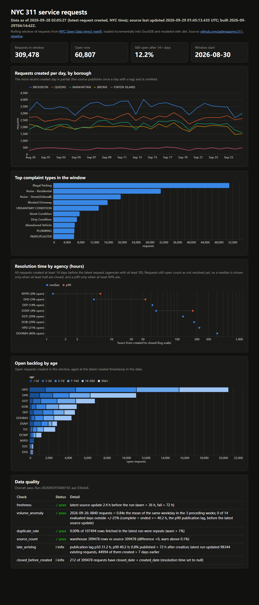

# nyc311-pipeline

Incremental ELT of [NYC 311 service requests](https://data.cityofnewyork.us/Social-Services/311-Service-Requests-from-2010-to-Present/erm2-nwe9)
into DuckDB, modeled with dbt, checked for data quality, refreshed daily by GitHub Actions and
published as a static dashboard: **https://adleraaa.github.io/nyc311-pipeline/**

The 311 dataset is large (tens of millions of rows) and changes in place: requests are
created, reassigned and closed days later. The pipeline keeps a rolling 30-day window
of requests in sync without re-downloading it every day: a Python extractor pages
through the Socrata API from a stored watermark, lands each page as Parquet and merges
it into DuckDB on `unique_key`; dbt builds staging, intermediate and mart models with
tests; a Python step runs quality checks (freshness, volume anomaly, duplicate rate,
source count, late-arriving data) and the marts are exported to JSON for a Vega-Lite dashboard.



## Results

Measured on 2026-09-29 (UTC) on a Windows 11 laptop (i9-14900HX, home internet), from the
committed files in [`results/`](results/). `results/` is a snapshot of that day's runs; the
Quickstart below writes to `out/` so it does not overwrite it.

| What | Value | Source |
|---|---|---|
| Cold backfill of the 30-day window (created since 2026-08-30) | 300,328 rows, 16 pages of 20,000, 162.7 s | `results/extract_run_1_backfill.json` |
| Key-level reconciliation after the backfill (warehouse keys vs the source's key list for the window) | 300,328 vs 300,328 keys; 0 missing, 0 extra; 0 of 29 days with a count difference | `results/reconciliation_before_incremental.json` |
| First incremental attempt after the source's 2026-09-29 update, before the stale-replica fix | 0 rows fetched in 0.8 s, although the source already had 9,120 keys the warehouse lacked (see Design decisions) | `results/extract_run_3_stale_replica_before_fix.json`, `results/reconciliation_after_stale_run.json` |
| Incremental run after the fix (same watermark, same source update) | 107,494 rows in 6 pages: 9,150 inserted, 98,344 updated, 0 pruned; 66.3 s, of which about 40 s were four 10 s waits for an up-to-date replica | `results/extract_run_4_incremental.json`, `results/extract_run_4_incremental_log.txt` |
| Key-level reconciliation after that incremental merge | 309,478 vs 309,478 keys; 0 missing, 0 extra; 0 of 30 days with a count difference; every response from one dataset version | `results/reconciliation_after_incremental.json` |
| `dbt build` on the updated warehouse (5 models, 26 data tests) | 31 of 31 passed, 1.69 s | `results/dbt_build_log.txt` |
| Custom quality checks | overall pass (details below) | `results/quality_report.md` |
| Rows sharing a single `:updated_at` value in the source (last 10 days) | 538,015 of 662,561 updated rows in one batch | `results/source_update_batches.json` |
| Same pipeline on GitHub Actions: cold start / next run with cached state / incremental after the 2026-09-29 update | 300,328 rows in 341.9 s / 0 rows in 0.6 s / 107,494 rows (9,150 new, 98,344 updated) in 168.6 s, about 140 s of it waiting out stale replicas | `results/github_actions_runs.md` |
| pytest | 49 passed | `results/pytest_summary.txt` |

The Actions cold start was slow for a reason unrelated to the pipeline: the first page request
(no watermark, the whole window ordered by `:updated_at`) hit the 180 s read timeout and was
retried, so about 248 s of the 341.9 s went to page 1 and the other 15 pages took about 94 s after it
arrived (timestamps in `results/github_actions_runs.md`).

What the data showed for this window (`results/pipeline_summary.json`, `results/quality_report.md`):

- Resolution cohort (requests created at least 14 days before the latest request): 160,002
  requests, 12.2% still open. Median hours by agency: NYPD 1.29 (79,996 requests, 0% open),
  DHS 5.42, DEP 42.19, DSNY 47.92, DOT 123.31, DOB 181.63, HPD 218.97 (20.8% open),
  DOHMH 408.42 (46.2% open). No median is reported for DPR (58.1% open), DCWP (60.9%),
  OOS (79.0%), TLC (81.1%) and EDC (100%), because more than half of their cohort is still open.
- The earlier closed-requests-only method (`results/pipeline_summary.json` at commit a171942,
  data one day older) gave HPD 122.64 h and DOHMH 80.32 h. Leaving out the requests that were
  still open understated HPD's median by about 44% and DOHMH's by a factor of five.
- Top complaint types in the window: Illegal Parking (51,042), Noise - Residential (31,182),
  Noise - Street/Sidewalk (19,570).
- Quality report: freshness lag 2.4 h. The last complete day, 2026-09-26 (a Saturday), had
  8,840 requests, 0.84x the mean of the 3 preceding Saturdays; 0 of 14 evaluated days fell
  outside +/-25%. A day counts as complete once the p90 publication lag (40.2 h) has passed; the
  median lag from request creation to first publication is 31.2 h. The incremental run updated
  98,344 existing requests, 44,994 of them created more than 7 days earlier. 212 requests have
  a closed date earlier than their created date.

## Architecture

```
Socrata API (erm2-nwe9)
   |  SoQL: $where created_date >= window_start AND (:updated_at, unique_key) > watermark
   |        $order :updated_at, unique_key   $limit 20000
   v
nyc311 extract (Python)
   |-- data/landing/<run_id>/page_NNNNN.parquet     raw pages, kept 7 days
   '-- data/warehouse.duckdb
         raw.service_requests   INSERT ... ON CONFLICT (unique_key) DO UPDATE
         raw.extract_state      watermark + covered_from, committed with each page
         raw.extract_runs       one audit row per run (written at start, finished at end)
   v
dbt build (dbt-duckdb)
   staging.stg_service_requests      types, trimming, borough normalization, NY -> UTC times
   intermediate.int_requests_enriched   day, open/closed, resolution hours, open age
   marts.fct_daily_volume            day x borough x complaint type
   marts.agg_resolution_time         median / p90 hours by agency x type (+ agency rollup),
                                     cohort created >= 14 days before the snapshot
   marts.agg_open_backlog_aging      open requests by agency x type x age bucket
   v
nyc311 quality   ->  quality_report.json / .md
nyc311 build-site -> _site/ (static HTML + data/*.json)  ->  GitHub Pages
```

Two workflows:

- `.github/workflows/ci.yml` (push / PR): ruff, pytest with mocked HTTP, then the whole
  pipeline on the committed fixture in a separate warehouse file (`load-fixture`, `dbt build`,
  `quality --offline`, `build-site`). No network or secrets.
- `.github/workflows/pipeline.yml` (daily 07:30 UTC + manual): restore state from the
  Actions cache, extract, save state (also after a failed extract), `dbt build`, quality,
  build the site, deploy Pages.

## Quickstart / Reproduce

Requires Python 3.12+. Run from the repository root.

```bash
python -m venv .venv && source .venv/bin/activate      # Windows: .venv\Scripts\activate
pip install -r requirements-dev.txt

# Live data (a few minutes and about 300k rows for a cold 30-day backfill)
python -m nyc311 -v extract --window-days 30 --stats-out out/extract_run.json
python -m scripts.reconcile                            # key-level diff vs the source -> out/
dbt build --project-dir dbt --profiles-dir dbt
python -m nyc311 quality --out out
python -m nyc311 summary                               # -> out/pipeline_summary.json
python -m nyc311 build-site --out _site --quality out/quality_report.json
python -m http.server -d _site 8000                    # open http://localhost:8000
python -m scripts.profile_source                       # -> out/source_update_batches.json

# Offline, from the committed fixture (what CI runs), in its own warehouse file
export NYC311_DB_PATH=data-ci/warehouse.duckdb         # the dbt profile reads this
python -m nyc311 --db data-ci/warehouse.duckdb load-fixture tests/fixtures/sample_311.json.gz
dbt build --project-dir dbt --profiles-dir dbt
python -m nyc311 --db data-ci/warehouse.duckdb quality --offline --out out/ci

# Tests and lint
pytest -q
ruff check . && ruff format --check .
```

Running `extract` again continues from the stored watermark. Delete `data/` to start over.
Set `SOCRATA_APP_TOKEN` to send an app token (optional; raises the API rate limit).
`load-fixture` refuses a warehouse that already holds API data, and never writes the
extractor's watermark, so an `extract` after it starts with a full backfill.

## Design decisions

- **Keyset paging on `(:updated_at, unique_key)` instead of `$offset`.** The source writes its
  daily update as one batch with a single `:updated_at` (538,015 rows shared one value in the
  last 10 days). A watermark on the timestamp alone cannot say where inside that batch a page
  ended, and `$offset` shifts when rows change during a run. The key tiebreaker gives every row a
  unique position; `scripts/reconcile.py` checks the result key by key against the source.
- **Watermark committed in the same transaction as each page, and state saved even when the
  extract fails.** A crash loses at most the page in flight; the scheduled job saves the Actions
  cache unless the run was cancelled, so the next run resumes after the last committed row.
  Reprocessing is safe because the load is an upsert (tested in `tests/test_extract.py`).
- **`covered_from` moves with the prune.** The state records the earliest `created_date` the
  warehouse holds. It is advanced to the new window start in the same transaction that deletes
  rows that aged out, so a later, wider `--window-days` triggers a backfill instead of silently
  missing the pruned rows (regression test `test_narrow_then_wider_window_forces_backfill`).
- **Answers from stale replicas are refused.** Socrata serves reads from replicas, and during
  the daily rollout most of them still hold the previous version (the 2026-09-29 batch is
  stamped 01:33 UTC, was first returned by a manual poll at 04:05 UTC, and stale answers were
  still common at 04:19). A stale replica answers a keyset query with "nothing after the
  watermark", which looks exactly like a quiet day: the first incremental attempt fetched 0 rows
  while 9,120 new keys existed. `get_fresh()` checks the `X-SODA2-Data-Out-Of-Date` header and
  retries (6 attempts, 10 s apart); if every attempt is stale the run stops with status
  `stale_source`, keeping its committed pages, and the next run resumes from there.
- **`ON CONFLICT DO UPDATE` rather than `INSERT OR REPLACE`.** Replace would delete and
  re-insert the row, losing `_first_loaded_at` and `_load_count`, which the late-update check
  reads.
- **Raw layer is all VARCHAR; typing and time zones happen in dbt staging.** A malformed value
  becomes NULL instead of failing the load. `created_date`/`closed_date` are New York wall-clock
  times, so staging converts them to UTC with DuckDB's bundled ICU; every duration uses the UTC
  columns, which keeps resolution hours right across DST changes (tested with a request that
  spans 2026-03-08).
- **Resolution times from a cohort, not from closed requests only.** Ranking only closed
  requests biases toward fast cases because the slow ones are still open. The mart ranks every
  request created at least 14 days before the snapshot and counts open ones as not resolved
  yet, so a median is reported only when at least half the cohort is closed (p90: 90%), and the
  share still open is shown next to it.

## Data

Source: NYC Open Data, "311 Service Requests from 2010 to Present", dataset `erm2-nwe9`,
https://data.cityofnewyork.us/Social-Services/311-Service-Requests-from-2010-to-Present/erm2-nwe9,
published by the City of New York under the
[NYC Open Data Terms of Use](https://opendata.cityofnewyork.us/overview/#termsofuse)
(free to use and redistribute; no warranty). `tests/fixtures/sample_311.json.gz` is a
3,010-row sample of that dataset (requests whose `unique_key` ends in `00`, created in the 30
days before 2026-09-29), generated by `scripts/make_fixture.py`. No data is LLM-generated.

## Limitations

- Requests deleted or withdrawn upstream never get a newer `:updated_at`, so the incremental
  path cannot see them; they stay in the warehouse until they age out of the window. The
  `source_count` quality check (warehouse vs API `count(*)`, warn above 0.1%) and
  `scripts/reconcile.py` (key-level diff) detect this drift; nothing repairs it automatically
  short of deleting the state to force a backfill.
- Pruning (dropping rows that age out of the window) has not yet run on live data: every
  recorded run so far had the same window start (2026-08-30), so `rows_pruned` is 0 in all
  of them. It is covered by unit tests, including the narrow-then-wide window regression test.
- Stale-replica retries make run time depend on the API: 14 retries turned a ~30 s incremental
  into 168.6 s on Actions. If all 6 attempts for a page are stale, that day's run ends early
  (`stale_source`) and the data is a day behind until the next run.
- The daily-volume chart leaves out only the latest created day; the day before it is usually
  still filling in too (the volume check uses the p90 publication lag instead).
- The resolution cohort covers requests created 14-30 days before the snapshot, so it describes
  resolution within roughly two to four weeks; for agencies where more than half of those
  requests are still open, no median is reported. Backlog ages are capped at the window length.
- The window boundary uses the UTC calendar date while `created_date` is New York local time,
  so the first day of the window can start a few hours off. Durations are not affected.
- The volume check compares each complete day with the same weekday in up to 4 earlier weeks
  (at least 2 are required, so about 13 days of a 30-day window get evaluated). Holidays are
  not modeled.
- Borough normalization maps the county and borough names found in the feed; it does not
  geocode requests whose borough is unspecified; they are kept as `UNSPECIFIED` and left
  off the borough chart.
- GitHub disables scheduled workflows after 60 days without repository activity, and cache
  entries unused for 7 days are evicted (which triggers a full backfill).
- The duplicate check measures keys the source delivered more than once in a run; it does not
  detect two different requests describing the same incident.

## License

MIT, copyright 2026 Yunlong Lu. See [LICENSE](LICENSE).
